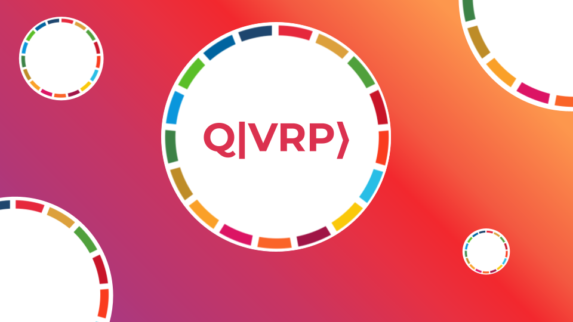
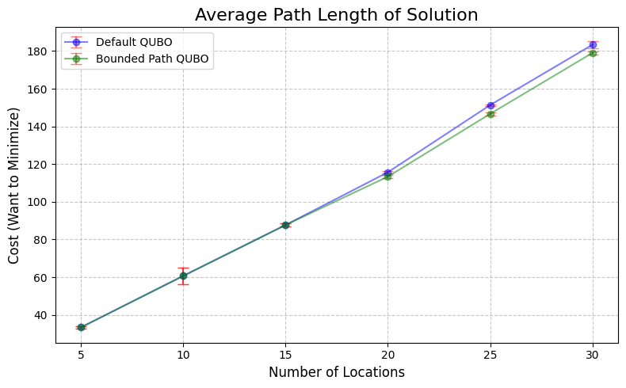
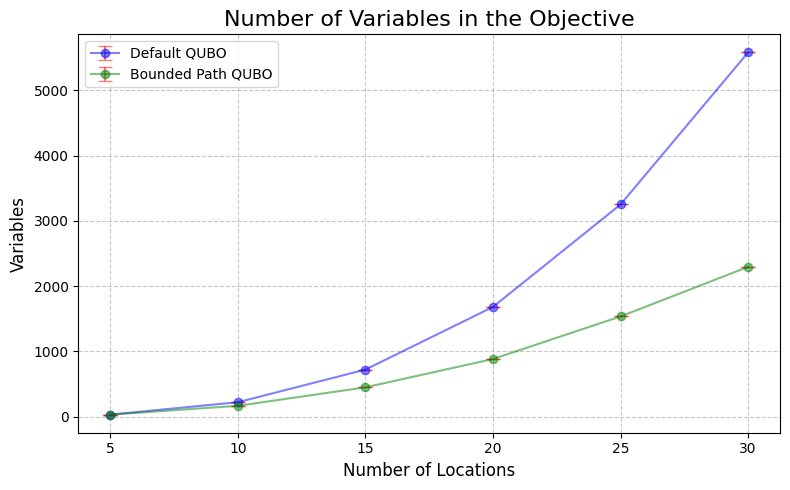
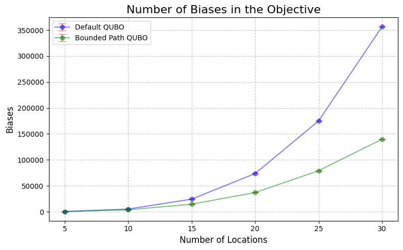
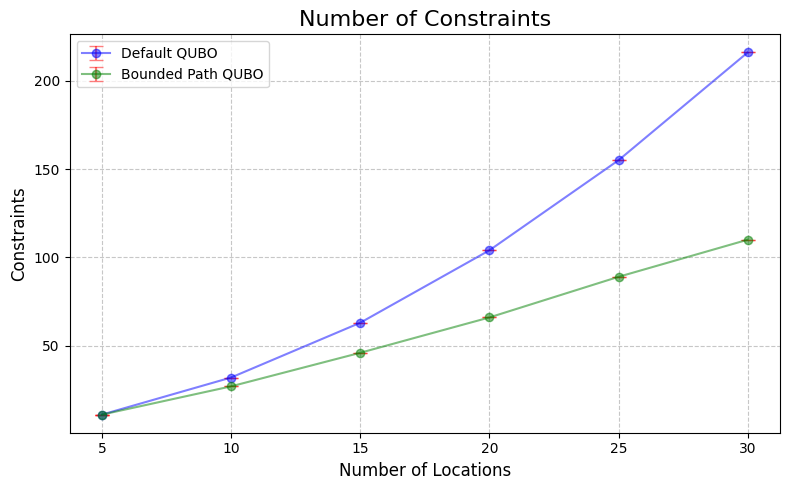

## Motivation
This project is part of an initiative by Open Quantum Institute to leverage quantum computing for the UN sustainable development goals. In this project, we aim to develop methods to more efficiently route food from producers to consumers. By doing so, we hope to reduce waste and emmisions while providing versatile tools to connect small farmers to the global supply chain. Read our preliminary report and why we believe that quantum computing in the [OQI 2024 Sustainable Development Goal Use Cases Whitepaper](https://lnkd.in/dGjVEHHt)!

## Getting Started

### Create a Virtual Environment

It is highly recommended that you create a virtual environment for the dependencies of this project, and conda is recommended for this (this requires that you install anaconda first).

To create an environment with all the dependencies for this project, run

```bash
conda create --name dwave_env --file requirements.txt
```

Then activate this environment with

```bash
conda activate dwave_env
```

### Get an Access Token for DWave

You will need a token to run code on DWave hardware which is not included in this repository since the repository is public and I don't want strangers using my limited compute time. To do so, first [create a DWave account](https://www.dwavesys.com/solutions-and-products/ocean/). After your account is created, you will get a token which is on the left pannel of the account screen (you may need to scroll down). This page will also show you how many hours you have left for the month on the annealer. Once you get a token, create a file ```credentials.py``` and create a variable ```TOKEN``` and set it equal to your token string. The ```.gitignore``` file is configured to ignore the ```credentials.py``` file when you publish any code to the public GitHub, so your token will be safe. 

## File Overview
* The ```routing_problems``` repository contains a set of vehicle routing problems to benchmark various QUBO approaches. Files are named with the convention vrp_{number of vehicles}m_{number of locations}n_{max distance per vehicle}c_v{version}. The problem is represented by an object of type ```RoutingProblem``` (defined in ```routing_problem.py```).

* The ```results``` directory contains subdirectories for different QUBO representations and stores results of these models on the routing problems. The result of sampling from the DWave annealer with these given QUBO representations are stored as a ```RoutingSolution``` object (defined in ```routing_problem.py```). The motivation of saving results is both to make them easily retrievable at a later point and to save on limited quantum processor time.

* ```vrp.py``` outlines the implementations of the objective functions and constraints for various QUBO representations of the Vehicle Routing Problem

* ```vrp_scaling.py``` provides a simple interface to test a given QUBO representation on all of the benchmark graphs.

## Current Results

The Bounded Path QUBO variant proposed provably requires asymptotically fewer qubits and variables, but also tends to perform marginally better. Our group is working to analyze and improve on these results, but the working hypothesis is that the condensed represenation has a lower proportion of infeasible states and thus makes it easier to find an optimal solution. The comparison of Bounded Path QUBO and Classic QUBO are shown below.










## Other Notes
Running any file that calls on the dwave annealer will use up some of your compute time for the month (likely ~0.5%). There is no need to be stingy, but take advantage of how a markdown saves the states of variables as well as saving results as ```RoutingSolutions``` to minimize time spent re-running analysis.